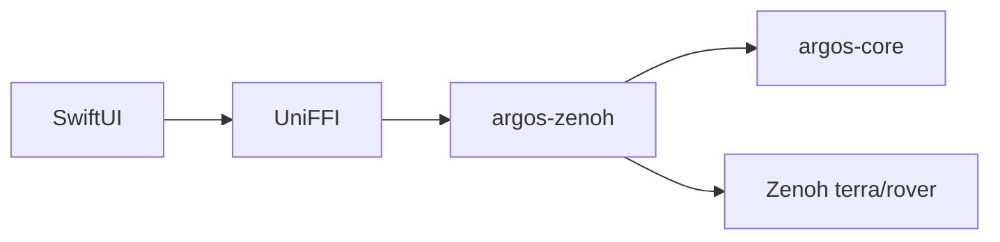

# ARGOS native fleet supervision

!!! tip "TL;DR"
    Rust validates and talks to Zenoh.
    SwiftUI draws the fleet.
    Terra still owns motors and watchdogs.

*The app polls snapshots. Views do not subscribe on their own.*

ARGOS supervises Terra rovers through Zenoh. Terra owns sensing, onboard
waypoint execution, motor control, and watchdogs. ARGOS owns discovery, live
operator state, and high-level waypoint/cancel requests.

## Native architecture

| Component | Responsibility |
| --- | --- |
| `crates/argos-core` | Contract validation, pose metadata, coordinate projection, freshness, and command acknowledgement |
| `crates/argos-zenoh` | Native TCP session, fleet/status/depth subscriptions, one-shot goal publication |
| `crates/argos-ffi` | UniFFI-owned records, typed errors, client lifecycle |
| `apps/apple/Shared` | Shared SwiftUI fleet, map, connection settings, and waypoint flow |
| `apps/apple/ARGOS.xcodeproj` | Native macOS and iOS app/test targets |
| `scripts` | Cargo/UniFFI/XCFramework generation and live Swift smoke test |

The Swift actor owns the Rust client, keeping connect/send/disconnect operations
off MainActor. The presentation model polls immutable snapshots at 5 Hz and
updates SwiftUI on MainActor. Views do not subscribe to Zenoh independently.
No browser bridge, Dioxus, web server, or image decoding is part of the app.

## Terra topics

The default prefix is `terra/rover`; override it in Connection settings to match
Terra's `TERRA_ZENOH_PREFIX`.

| Key | Direction | Role |
| --- | --- | --- |
| `<prefix>/fleet/state` | Terra -> ARGOS | Membership and fleet freshness |
| `<prefix>/<id>/goal` | ARGOS -> Terra | One latched local/geographic goal or cancellation |
| `<prefix>/<id>/goal/status` | Terra -> ARGOS | idle/active/arrived, correlation token, target, remaining distance |
| `<prefix>/<id>/camera/depth` | Terra -> ARGOS | Header-only rover body pose; discard pixel data |

The endpoint defaults to `tcp/127.0.0.1:7447`; a physical phone needs the
simulator computer's LAN address. Session mode is client, multicast discovery
is disabled, and goal publication uses per-rover keys.

*The slice this note describes.*

## Operator semantics

Fleet IDs can have gaps. Membership follows `ids`; disagreement between count
and ID length is shown as a notice. Unknown/removed members cannot receive
commands. Membership, pose, and goal status have independent monotonic receive
ages; 90 seconds is stale for fleet supervision and waypoint submission. Manual control retains its strict freshness limits. Bad telemetry preserves the last good values without
refreshing their ages.

Goals use exact Terra shapes, finite values, bounded coordinates/yaw/tokens,
and a 2048-byte request cap. ARGOS generates a UUID token and publishes once;
a matching status confirms acceptance. Unconfirmed after 150 seconds means
no acknowledgement, not failure or arrival. ARGOS does not automatically retry.
Cancel sends exactly `{"cancel":true}` and waits for a subsequent idle status.
This releases Terra's latched goal for debug teleop; it does not send a twist.

Goal-status x/y describe the target. Rover position comes from the depth header's
exposure-aligned `body` pose. With geographic tiles, local +x is north and +y is
west of the configured anchor. Local mode uses a coordinate plot in metres;
geographic mode uses MapKit at the matching anchor, default GMU Johnson Center
38.8297, -77.3075. The bus does not advertise the anchor or tile-load success.

Closing/disconnecting/backgrounding ARGOS does not cancel Terra's goal. Fresh
observation resumes after foreground/reconnect without command replay. This
MVP assumes one operator; cancellation has no wire token and cannot support
strong multi-operator correlation. No continuous iOS background operation is
promised.

## Scope

Native macOS/iOS operator apps and a portable Rust core are the first slice.
Video, urgency ranking, natural-language commands, fleet resizing controls,
authentication, multi-user arbitration, browser UI, and Android apps are outside
this slice. Native Apple UI builds require macOS/Xcode; Codespaces can run Rust
checks and Terra. Physical-phone signing/LAN tests remain distinct from simulator
verification.

## Real-phone prototype over Tailscale

A foreground TerraPhone can now connect outward to a Mac-hosted Zenoh router. ARGOS subscribes to lightweight `<prefix>/<id>/pose` JSON (`rover_id`, `sequence`, `x`, `y`, `yaw`) as well as the existing simulator depth header. The phone controls connect/disconnect separately from its Bluetooth hardware link. Connect never arms hardware; phone disconnect/backgrounding clears remote intent and disarms. This is distinct from ARGOS itself disconnecting, which does not cancel a phone goal.

For initial local-coordinate tests, run Terra's `scripts/dashboard-router.sh`, configure ARGOS with `tcp/127.0.0.1:7448` and prefix `terra/phone`, and configure the phone with the Mac's Tailscale address on port 7448 and the same prefix. Phone IMU/VIO or Bluetooth feedback control must be running. Geographic mode stays off because ARKit's local frame has no established geographic alignment. See the companion Terra `docs/DASHBOARD_TAILSCALE.md` for setup and verification.

This slice supports one physical phone per topic prefix; its singleton fleet publisher is not a multi-phone membership aggregator. No video, MQTT migration, cloud deployment, or continuous background phone operation is added. On October 8, 2026 the paired generated-Swift smoke verified pose, matching goal acknowledgement, cancel and explicit reconnect through a local router. Real Tailscale and physical rover verification remain separate.
