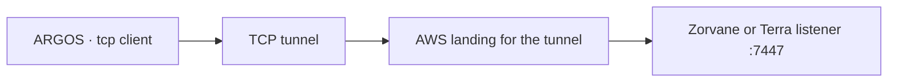

# Deployment

ARGOS is the operator app. It dials one TCP endpoint. It does not listen, and it does not discover peers. Where that endpoint lives is the deployment choice. LAN is what the app and Zorvane implement. Reaching a fleet through AWS is planned, and it has to stay a TCP endpoint the same client can type.

## Session the app actually opens

`Client::connect` in `crates/argos-zenoh`:

- Zenoh mode `client`
- `connect/endpoints` set to the Connection field
- multicast scouting disabled
- connect timeout 3000 ms
- endpoint required to be `tcp/…`

The Mac app is allowed outgoing network by `apps/apple/macOS/ARGOS.entitlements`. iOS declares local-network usage and the system prompts for it. There is no authentication on this session. `docs/DESIGN.md` leaves authentication and multi-user arbitration outside the current slice. Anyone who can open the endpoint can publish goals and teleop on the prefix.

## LAN

This is the path used for a simulator on a computer and for a phone on the same network.

1. Start Zorvane (or a Terra stack that speaks the same keys) bound to an address the operator can route to. On one machine, the default `tcp/127.0.0.1:7447` is enough. For another device, set `TERRA_ZENOH_LISTEN=tcp/0.0.0.0:7447`.
2. In ARGOS Connection, set the endpoint to `tcp/<host>:7447` and the prefix to the peer’s prefix (`terra/rover` unless `TERRA_ZENOH_PREFIX` was changed).
3. On a physical iPhone, `<host>` is the computer’s LAN address. `127.0.0.1` on the phone is the phone.
4. Set the map anchor to the world’s anchor. Geographic mode for the bundled GMU patch is latitude `38.8297`, longitude `-77.3075`.

The phone and the computer have to be on a network that allows that TCP port. iOS will not complete the session if local-network permission is denied. Allow it and connect again.

Physical-phone signing and a LAN run are still a separate check from the simulator. The [Apple execution ledger](implementation/apple-progress.md) records them as unverified. Simulator arrival and cancel are recorded under [Native dashboard evidence](evidence/README.md).

TerraPhone’s own control listener is loopback-only. That restriction is on the Terra side, called out in the [mission operator controls](autonomy/README.md), because an unauthenticated LAN listener was rejected in review. ARGOS is the client in the LAN setup above; it is not that listener.

## AWS via a tunnel

!!! warning "Planned"
    This repo has no AWS client, no tunnel process, and no Zenoh router config. The steps below are the shape that fits the client that exists. They are not a supported deployment.

The client will talk to a remote fleet only if that fleet’s Zenoh listener shows up as some `tcp/host:port` the operator can open. Multicast scouting is off, so a cloud router that is not in `connect/endpoints` is invisible.

The intended shape, once it is built:

The vehicle or the simulator keeps listening on a private interface. A tunnel terminates on AWS when the operator is off the vehicle LAN, and the operator either dials the AWS side or dials a forward on localhost. Connection still holds one `tcp/` string. The app does not learn that a tunnel is there, and disconnect still does not cancel a latched goal.

Two constraints come from the code, and a future tunnel has to respect both:

- **The endpoint is the whole configuration.** There is no second channel for credentials. Until bus authentication exists, a world-reachable port accepts any client that knows it. The planned AWS path therefore keeps the listener private and carries only the operator’s tunnel, rather than publishing port 7447 on a public security group.
- **One operator, no replay.** Cancel has no token. A second client on the same prefix can cancel or replace a goal without ARGOS correlating it. Reconnect does not republish the previous command. A tunnel drop looks like a disconnect: observation resumes when the TCP session returns, and the vehicle keeps any goal it already latched.

No VPC, security group, or tunnel binary is defined here. When that work lands it should be a small operator-side forward plus a private listener, with the same prefix and the same anchor rules as the LAN path.
