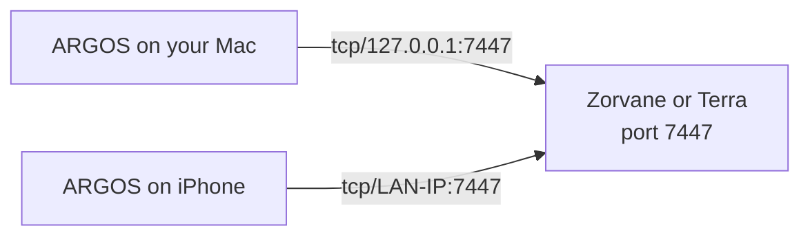
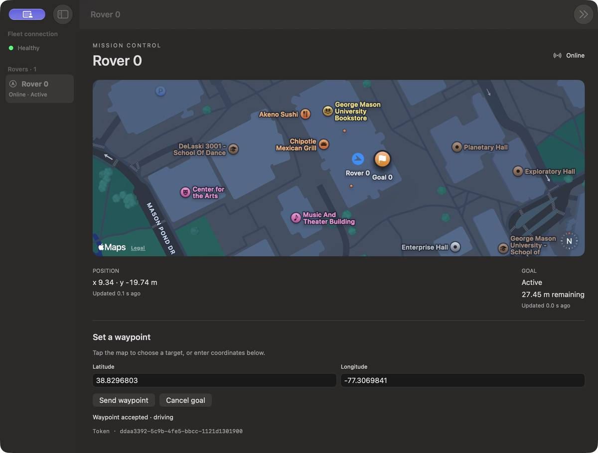
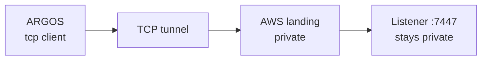

# Deployment

!!! tip "TL;DR"
    ARGOS dials one `tcp/` address. It does not listen.
    **LAN** is what works today.
    **AWS** is a future tunnel in front of that same address.
    There is no login on the bus.

## On one network

*The phone’s localhost is the phone. Use the computer’s LAN address.*

1. Start the world on an address you can route to.
   One machine: the default `tcp/127.0.0.1:7447`.
   Another device: `TERRA_ZENOH_LISTEN=tcp/0.0.0.0:7447`.
2. Connection endpoint `tcp/<host>:7447`. Prefix `terra/rover`, unless `TERRA_ZENOH_PREFIX` changed.
3. Anchor matches the world. GMU patch: `38.8297`, `-77.3075`.

*A connected session. The link pill is the deployment check.*

iOS asks for local network. Deny it and the session fails. Allow it and connect again.

A signed phone on a real LAN is still a separate check from the simulator. The [ledger](implementation/apple-progress.md) records that phone run as unverified.

TerraPhone’s own listener is loopback-only. ARGOS is the client in the picture above.

## What the session is

From `Client::connect`:

- Zenoh mode `client`
- One endpoint
- Multicast scouting off
- 3000 ms connect timeout
- `tcp/` required

No credentials. Anyone who can open the port can publish goals. Authentication is still outside this slice.

## Off the LAN, via AWS

!!! warning "Planned"
    This repo has no AWS client and no tunnel program.
    The sketch is the shape that fits the client we have.

*The app still holds one `tcp/host:port` string. It never learns that a tunnel is there.*

The listener stays private.

The tunnel is the only door.

A public port 7447 would accept any client, because the session has no login.

A dropped tunnel looks like a disconnect. Observation resumes when TCP returns. A goal already latched on the vehicle stays latched.

Cancel has no token. A second client on the same prefix can replace a goal.

When this is built, it should be a private forward plus the same prefix and the same anchor as the LAN path.
