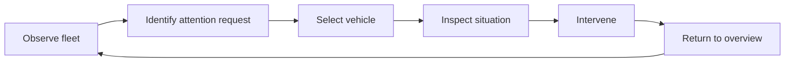

# ARGOS 3D spatial dashboard

!!! tip "TL;DR"
    The environment is the interface. One operator, many vehicles, one 3D place.
    Level 1 (overview) and level 2 (selection) have no panels. A detail panel is allowed only at level 3 (inspection).
    Every glow, ring, and line is backed by a Zenoh key under `terra/rover/<id>/...`. Where no key exists yet, this page calls it a **gap** and names the issue that would add it.
    First milestone: a desktop prototype of levels 1 and 2, driven by Zorvane with 15 to 20 simulated rovers. Quest 3 and hand tracking come later.
    No framework has been chosen. A time-boxed spike decides ([ARGOS #15](https://github.com/Super-Yojan/ARGOS/issues/15)).

*Reference concept: overview, selected, context details. The image is an illustration. Names and numbers in it (for example `TERRA-03`, battery `84%`, `L3 Navigating`) are not data.*

Status: **design draft**, owner Yojan Gautam ([@Super-Yojan](https://github.com/Super-Yojan)).
Tracking: [ARGOS #14](https://github.com/Super-Yojan/ARGOS/issues/14).
It extends the [2D operator dashboard draft](operator-dashboard/README.md) from [ARGOS #8](https://github.com/Super-Yojan/ARGOS/issues/8), and is the 3D successor to the list-and-map console from [ARGOS #3](https://github.com/Super-Yojan/ARGOS/issues/3) and [#4](https://github.com/Super-Yojan/ARGOS/issues/4).

!!! note "How to read this page"
    **Exists** means the key is on `main` in Terra or Zorvane today. **In PR** means it is in an open, unmerged pull request. **Gap** means nothing publishes it yet. Anything marked *proposed* is a design proposal, not a decision and not a measurement.

## 1. Vision and principles

ARGOS should feel like an immersive spatial digital twin, not a panel dashboard. One operator supervises many ground and aerial vehicles without overload. The thesis question behind it: how much autonomy and information does each robot need for one human to supervise a large fleet?

**Look.** A dark, cinematic 3D scene with holographic terrain: mountains, forests, rivers, roads, elevation. Cyan is the primary colour; amber and red mark attention. Vehicles are small 3D models. Paths glow. Status is carried by colour, animation, symbols, and light. There are no permanent floating panels or HUD. Input is mouse and touch first, hand tracking later. The camera is free: orbit, zoom, and focus.

**Principles.**

| Principle | Meaning here |
| --- | --- |
| Spatial first | State lives on the vehicle and on the ground, not in a side panel. |
| Minimal by default | Level 1 shows only what is needed to notice that something needs you. |
| Attention-driven | Amber and red pull the eye. Everything else stays quiet. |
| Contextual interaction | Detail appears where and when you select it, then goes away. |
| Scalable supervision | It must still read at 15 to 20 vehicles. Unselected vehicles dim on selection. |

**Operator flow.**

**Design decisions from review.**

1. The concept image above is the visual reference.
2. Every visual is backed by data. See the [data-binding table](#5-data-binding). Effects that carry no meaning are not allowed.
3. Attention cues double as the experiment's intervention measures. Every attention event and every operator response is logged with timestamps and response time.
4. On selection, unselected vehicles dim. This is a key requirement at 15 to 20 rovers.
5. Levels 1 and 2 have no panels. The detail panel (concept stage 3) is acceptable at level 3.
6. Transport is Zenoh. MQTT is out. ARGOS already talks Zenoh through `crates/argos-zenoh`; the restart from RoverApp was partly about one shared stack.
7. First milestone: a desktop 3D prototype of levels 1 and 2, driven by Zorvane with 15 to 20 simulated rovers. Quest 3 and hand tracking come later.
8. The framework is chosen by a time-boxed spike with explicit criteria ([section 8](#8-tech-options-and-the-spike)).

## 2. Interaction levels

### Level 1: fleet overview (default)

Shows each vehicle's location and orientation, planned paths, status, waypoints, attention areas, obstacles and restricted regions, and aerial vehicles. No telemetry panels.

Issue: [ARGOS #17](https://github.com/Super-Yojan/ARGOS/issues/17).

### Level 2: selection

Click or tap a vehicle.

- A selection ring appears under it.
- The selected vehicle becomes prominent and its path brightens.
- All other vehicles, paths, and coverage dim.
- Minimal spatial context appears beside the vehicle as symbols, not a text panel: battery, autonomy level, connectivity, navigation status, objective.
- The camera focuses on it. Deselect, or zoom out, to return to level 1.

Issue: [ARGOS #18](https://github.com/Super-Yojan/ARGOS/issues/18).

### Level 3: inspection

Progressive disclosure for the selected vehicle: camera feed, occupancy grid, point cloud, obstacles, trajectories, telemetry, and the autonomy and mission controls. A detail panel is acceptable here.

Today's Apple app already has much of this in the selected-rover panel: the autonomy picker, takeover, emergency stop, proposal approval, held teleop, the observed occupancy overlay, and the TerraPhone point cloud ([ARGOS #4](https://github.com/Super-Yojan/ARGOS/issues/4), [DASHBOARD_UI.md](DASHBOARD_UI.md)). Level 3 moves that into the 3D scene.

Issue: [ARGOS #21](https://github.com/Super-Yojan/ARGOS/issues/21).

## 3. Status language

*Proposed.* Each cue has one meaning. A cue is drawn only when its data source says so.

| Cue | Meaning |
| --- | --- |
| Cyan glow | Normal |
| Amber pulse | Attention requested: waiting on the operator |
| Red pulse | Critical: fault, lost link, or stale data |
| Selection ring | Selected |
| Solid trajectory | Completed path |
| Dashed trajectory | Planned path |
| Translucent expanding geometry | Sensor coverage |
| Highlighted terrain | Active perception area |
| Dimmed vehicle | Not selected while another vehicle is selected |
| Desaturated or ghosted vehicle | Pose is stale. The last known position is shown, never a guessed one. |

Rule: effects must carry meaning. No ambient particles, idle animation, or decorative glow that is not tied to a row in the binding table.

## 4. Attention model and experiment logging

### Amber and red

*Proposed mapping.* All sources are per rover under `terra/rover/<id>/`.

| State | Trigger | Source | Status |
| --- | --- | --- | --- |
| Amber | A `goal/proposal` is waiting for approve or reject | `goal/proposal` (and `goal/decision` clears it) | Exists |
| Amber | A goal was rejected with `authority_required` (rover is not in `waypoint` or `supervised`) | `autonomy/status`: `result` = rejected, `request_reason` = `authority_required` | Exists |
| Amber | Safety hold that an operator can resolve: `safety` = `hold` with `reason` such as `obstacle_blocked` or `supervision_paused` | `autonomy/status` `safety`, `reason` | Exists |
| Amber | A survivor observation is waiting for operator confirmation, or a target-search report is waiting for acknowledgement | `mission/status` observations with `confirmed` false (confirm on `mission/report`); `search/report` (ack on `search/report/ack`) | Exists |
| Red | Emergency stop latched | `autonomy/status` `safety` = `emergency_stop` | Exists |
| Red | Stale data on the rover: `reason` = `map_stale`, `sensor_unhealthy`, or `invalid_time` | `autonomy/status` `reason` | Exists |
| Red | Lost link: pose, goal, or membership older than 2.5 s, or the rover left `fleet/state` | ARGOS freshness in `argos-core` | Exists (derived in ARGOS) |
| Red | Hardware not ready or disarmed while a mission expects motion | `hardware/status` (`ready`, `armed`, `reason`) | Exists (TerraPhone and Zorvane) |
| Red | Motor watchdog expired | Watchdog lives in `terra-motors`; no Zenoh key | **Gap**, [Terra #11](https://github.com/Super-Yojan/Terra/issues/11) |
| Amber or red | Battery low or critical | No key publishes battery | **Gap**, [Terra #11](https://github.com/Super-Yojan/Terra/issues/11) |
| Amber or red | Rover-raised help request (stuck, localization lost) with severity | No contract yet | **Gap**, [Terra #11](https://github.com/Super-Yojan/Terra/issues/11), ranking in [ARGOS #2](https://github.com/Super-Yojan/ARGOS/issues/2) |

Which `hold` reasons are amber and which are red is a proposal. See [open questions](#11-open-questions).

### What gets logged

ARGOS already writes `argos-session-<uuid>.jsonl` on connect (goals, cancels, actions, teleop packets, and observed `autonomy/status`, `goal/proposal`, `mission/status`, `experiment/status`, `search/*`, `hardware/status`). New *proposed* events:

| Event | Fields |
| --- | --- |
| `attention_raised` | rover id, level (amber/red), trigger, source key, source payload revision or token, session-relative time, UTC |
| `attention_cleared` | rover id, how it cleared (operator action, rover recovered, timeout), time |
| `attention_seen` | first time the cue was on screen and in the camera view |
| `operator_selected` | rover id, time, which level (L2 or L3) |
| `operator_response` | rover id, action (approve, reject, level change, takeover, stop, waypoint), linked `attention_raised` id, response time |

Response time is `operator_response` minus `attention_raised`, and separately minus `attention_seen`.

### Thesis measures this supports

The thesis experiment is real-world, NEXT-style search and rescue. The sim is for algorithm development only. It compares fixed against operator-chosen switching across four autonomy levels.

| Measure | Where it comes from |
| --- | --- |
| Mission success | `mission/status`, `search/report` confirmations, Zorvane run JSONL |
| Time | Session log and Zorvane run log timestamps |
| NASA-TLX workload | Questionnaire after each trial, outside the app (*proposed*) |
| Interventions | `operator_response` events plus existing action and teleop lines |
| Time held at each level | `effective_level` transitions in logged `autonomy/status` |
| Fleet scalability | Same metrics at 15 to 20 vehicles |

Issue: [ARGOS #19](https://github.com/Super-Yojan/ARGOS/issues/19). Ranking many simultaneous requests (the urgency classifier) stays in [ARGOS #2](https://github.com/Super-Yojan/ARGOS/issues/2).

## 5. Data binding

Visual, then the Zenoh source under `terra/rover/<id>/` unless noted, then whether it exists.

| Visual | Zenoh source | Status |
| --- | --- | --- |
| Vehicle position and heading | `camera/depth` header `body` pose (Zorvane); `pose` JSON (phone runtime) | Exists |
| Which vehicles exist | `terra/rover/fleet/state` (`count`, `max_count`, `ids`). `fleet/size` is the resize command; ARGOS only reads `fleet/state` | Exists |
| Connectivity glyph | ARGOS freshness (2.5 s) on pose, goal status, membership | Exists (derived) |
| Autonomy badge | `autonomy/status` `requested_level`, `effective_level`, `assigned_level`, `active_source` | Exists. `explore` is in [Terra PR #33](https://github.com/Super-Yojan/Terra/pull/33); ARGOS does not accept `explore` yet |
| Navigation status | `goal/status`: `idle` / `active` / `arrived`, `distance`, target `x`/`y`, `token` | Exists |
| Waypoint marker | `goal` (what ARGOS sent) and `goal/status` target | Exists |
| Proposed goal (amber) | `goal/proposal`; decision on `goal/decision` | Exists |
| Completed trajectory (solid) | ARGOS keeps a bounded history of received poses | Exists as data; ARGOS does not store history yet (work in [#17](https://github.com/Super-Yojan/ARGOS/issues/17)) |
| Planned trajectory (dashed) | No key publishes the planner's path (A* / local planner). `goal/status` gives only the destination | **Gap**. No Terra issue found; one is needed. Until then, draw the destination marker only, not a route |
| Sensor-coverage wireframe | `map/occupancy`: the rover's real occupancy grid from `terra-mapping` and depth (schema 1, cells −1…100, origin, resolution) | Exists (Zorvane and TerraPhone publish; ARGOS consumes) |
| Explore coverage | `exploration/status`: elapsed, remaining, target, coverage, end reason | **In PR**: [Terra PR #33](https://github.com/Super-Yojan/Terra/pull/33). Zorvane publish tracked in [Terra #37](https://github.com/Super-Yojan/Terra/issues/37). ARGOS does not subscribe yet |
| Shared fleet map | Fleet map key from multi-rover map merge | **Gap**, [Terra #36](https://github.com/Super-Yojan/Terra/issues/36) (needs [Zorvane #5](https://github.com/Super-Yojan/Zorvane/issues/5)) |
| Active perception area | No sensor frustum or field of view on the bus | **Gap**. *Proposed* interim: highlight cells that changed in the latest `map/occupancy`, labelled as derived |
| Obstacles | Occupied cells in `map/occupancy` | Exists |
| Restricted regions | No geofence key found | **Gap** |
| Objective | `mission/status`, `search/status` | Exists |
| Battery | Nothing publishes it; today's app shows "Not reported" | **Gap**, [Terra #11](https://github.com/Super-Yojan/Terra/issues/11) |
| Amber pulse | See [attention model](#4-attention-model-and-experiment-logging) | Exists, except help requests (gap) |
| Red pulse | See [attention model](#4-attention-model-and-experiment-logging) | Exists, except watchdog (gap) |
| Point cloud (level 3) | `pointcloud` (TerraPhone, about 3 Hz) | Exists on the phone. **Gap** in Zorvane |
| Camera feed (level 3) | `camera/rgb` (Zorvane) | Exists on the bus. ARGOS does not decode RGB yet |
| Autonomy and mission controls (level 3) | Publishes `autonomy`, `goal`, `goal/decision`, `safety`, `teleop`, `hardware`, `mission/report` | Exists ([ARGOS #4](https://github.com/Super-Yojan/ARGOS/issues/4)) |
| Terrain elevation | Zorvane loads Terrarium elevation tiles itself (`TERRA_TILES=1`, bundled GMU patch). The NEXT pitch (`TERRA_NEXT=1`) is flat. No key publishes terrain or the anchor | **Gap on the bus**. *Proposed:* ARGOS loads the same Terrarium tiles from the configured anchor ([#16](https://github.com/Super-Yojan/ARGOS/issues/16)) |
| Aerial vehicles | Zorvane registers only `terra-ground` | **Gap**. Not in the first milestone |

## 6. Scale requirements

*Proposed targets* for the first milestone. They are targets to test against, not results.

- 15 to 20 rovers from one Zorvane process (`TERRA_ROVER_COUNT`, maximum 32). ARGOS already caps retired rover rows at 32.
- Level 1 stays readable at 20: no overlapping labels, because there are no labels at level 1.
- Selection dims every unselected vehicle, path, and coverage mesh.
- Rendering holds the display's frame rate on the development Mac with 20 vehicles, 20 paths, and terrain. The spike measures this.
- Status reaches the scene within one ARGOS snapshot tick (the app polls at 5 Hz today).
- **Known risk:** ARGOS takes Zorvane pose from `camera/depth` headers and drops the pixels, so every depth frame still crosses the link. [Terra #36](https://github.com/Super-Yojan/Terra/issues/36) puts depth at about 1.9 MiB/s per rover; at 20 rovers that is roughly 38 MiB/s for pose alone. A lightweight sim `pose` key would remove this. No Zorvane issue exists for it yet.
- Multi-rover runs depend on [Zorvane #5](https://github.com/Super-Yojan/Zorvane/issues/5) (second rover working end to end).

Issue: [ARGOS #20](https://github.com/Super-Yojan/ARGOS/issues/20).

## 7. Seedance learnings

Two Seedance concept clips were rated by the owner: fleet overview **8.5/10**, rover selection **7.5/10**. Improvements wanted:

- Terrain less photoreal: wireframe, contours, point cloud.
- The selected rover becomes the focus while the rest dim.
- Point clouds show real perception.
- Spatial symbols instead of text panels.
- Planned and completed routes are distinguishable.

These feed the [status language](#3-status-language) and the terrain style in [#16](https://github.com/Super-Yojan/ARGOS/issues/16).

## 8. Tech options and the spike

No framework decision has been made. Recommendation: desktop first, Quest later.

| Criterion | Native Swift / SwiftUI / RealityKit / Metal | Unity + OpenXR |
| --- | --- | --- |
| Zenoh client | Exists: ARGOS's Rust `argos-zenoh` (Zenoh 1.10.1) through UniFFI already ships in the Mac and iOS app | No official C# binding. Community options: ZenohDotNet (Unity UPM package, embedded native library) and Zenoh-CS (wraps zenoh-c). Or expose `argos-core`/`argos-zenoh` through a C ABI (*proposed*). Version match with 1.10.1 to verify |
| Terrain from Zorvane elevation (GMU, NEXT) | Custom mesh from Terrarium heightmaps. To measure | Terrain or mesh from heightmaps. To measure |
| 20 vehicles | Today's SceneKit scene shares one rover mesh across instances. RealityKit to measure | To measure |
| Mac plus Quest 3 reach | Mac, iPad, Vision Pro. **No Quest 3** | Mac and Quest 3 through OpenXR |
| Reuse of Terra's Rust crates | Direct, via the existing UniFFI path | Needs a new FFI layer |

Note: the shipping Apple app uses SceneKit, not RealityKit.

The spike is time-boxed (*proposed*: one week). Output: a short decision record in `docs/` that scores both options on the five criteria above, with a measured 20-rover frame time on each, and a recommendation. Issue: [ARGOS #15](https://github.com/Super-Yojan/ARGOS/issues/15).

## 9. Issues

| Issue | Scope |
| --- | --- |
| [#14](https://github.com/Super-Yojan/ARGOS/issues/14) | Tracking: 3D dashboard desktop prototype |
| [#15](https://github.com/Super-Yojan/ARGOS/issues/15) | Framework spike and decision record |
| [#16](https://github.com/Super-Yojan/ARGOS/issues/16) | Holographic terrain from Zorvane/GMU elevation, plus the NEXT pitch |
| [#17](https://github.com/Super-Yojan/ARGOS/issues/17) | Level 1 fleet overview |
| [#18](https://github.com/Super-Yojan/ARGOS/issues/18) | Level 2 selection |
| [#19](https://github.com/Super-Yojan/ARGOS/issues/19) | Attention model and experiment event logging |
| [#20](https://github.com/Super-Yojan/ARGOS/issues/20) | Zorvane integration and 20-rover scale test |
| [#21](https://github.com/Super-Yojan/ARGOS/issues/21) | Level 3 inspection |
| [#22](https://github.com/Super-Yojan/ARGOS/issues/22) | Later: Quest 3 / OpenXR and hand tracking |

Dependencies outside ARGOS: [Zorvane #5](https://github.com/Super-Yojan/Zorvane/issues/5), [Terra PR #33](https://github.com/Super-Yojan/Terra/pull/33), [Terra #36](https://github.com/Super-Yojan/Terra/issues/36), [Terra #37](https://github.com/Super-Yojan/Terra/issues/37), [Terra #11](https://github.com/Super-Yojan/Terra/issues/11).

## 10. Milestones

*Proposed.* Dates follow the repo's phase labels where they apply.

| Milestone | Contents | Exit |
| --- | --- | --- |
| M0 Spike | [#15](https://github.com/Super-Yojan/ARGOS/issues/15) | Decision record merged |
| M1 Desktop L1 and L2 | [#16](https://github.com/Super-Yojan/ARGOS/issues/16), [#17](https://github.com/Super-Yojan/ARGOS/issues/17), [#18](https://github.com/Super-Yojan/ARGOS/issues/18), [#19](https://github.com/Super-Yojan/ARGOS/issues/19), [#20](https://github.com/Super-Yojan/ARGOS/issues/20) | 15 to 20 Zorvane rovers on the desktop; attention events in the session log |
| M2 Inspection | [#21](https://github.com/Super-Yojan/ARGOS/issues/21) | Level 3 replaces the current selected-rover panel |
| M3 Field trials | Real NEXT-style search and rescue with the thesis conditions | Logged trials |
| M4 Headset | [#22](https://github.com/Super-Yojan/ARGOS/issues/22) | Quest 3 build, hand tracking |

Phase label: `phase 3: operator intelligence` (Nov 2 to Nov 29, 2026).

## 11. Open questions

1. The [2D draft](operator-dashboard/README.md) keeps STOP ALL fixed in a corner in every view. That conflicts with "no permanent floating panels or HUD". Is a single always-reachable stop the one exception?
2. Which `safety` = `hold` reasons are amber (operator can resolve) and which are red? The split above is proposed.
3. Is an operator-initiated emergency stop red, or a separate "stopped" cue so it does not look like a fault?
4. Planned path: should Terra publish the planner path, and on which key? Until then only the destination is drawn.
5. Battery: which component publishes it, and at what rate ([Terra #11](https://github.com/Super-Yojan/Terra/issues/11))?
6. Real-world terrain: which elevation source covers the field site? The NEXT pitch in Zorvane is flat.
7. Aerial vehicles: none exist in Zorvane today. When do they enter scope?
8. In the fixed-switching condition, is the autonomy control hidden or locked? `autonomy/status` already carries `assigned_level`.
9. Off-screen attention: edge markers as in the 2D draft, and should they also sound?
10. NASA-TLX: paper or a separate app after each trial, so it stays outside the operator's scene?
11. Does this 3D design replace the 2D wireframe draft, or does the 2D camera stay as a view of the same place?
