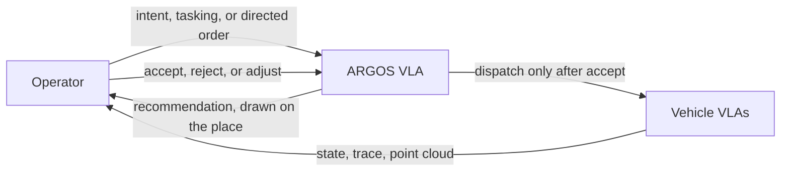
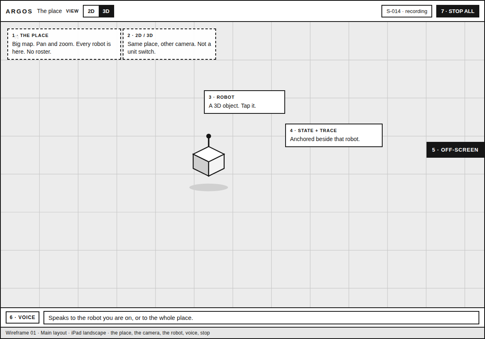
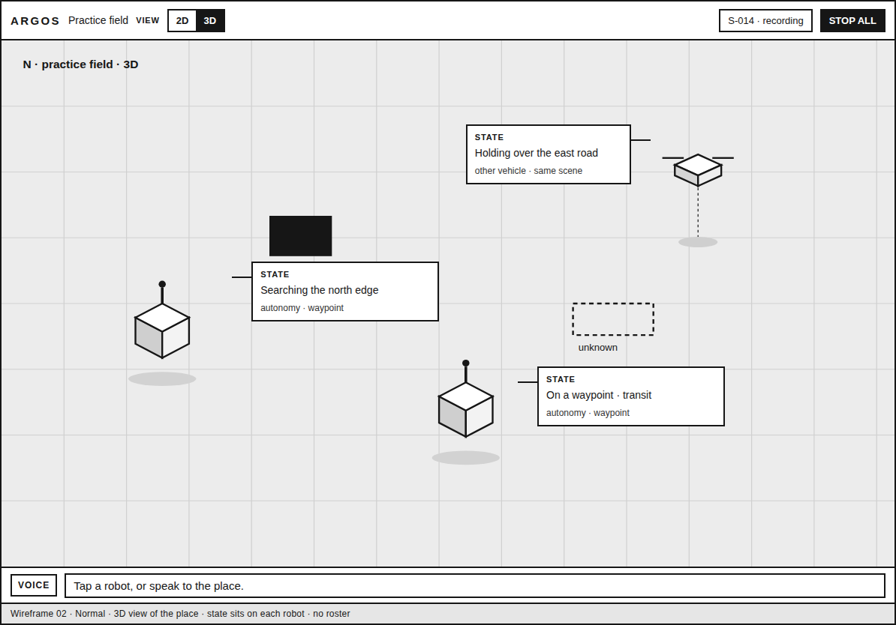
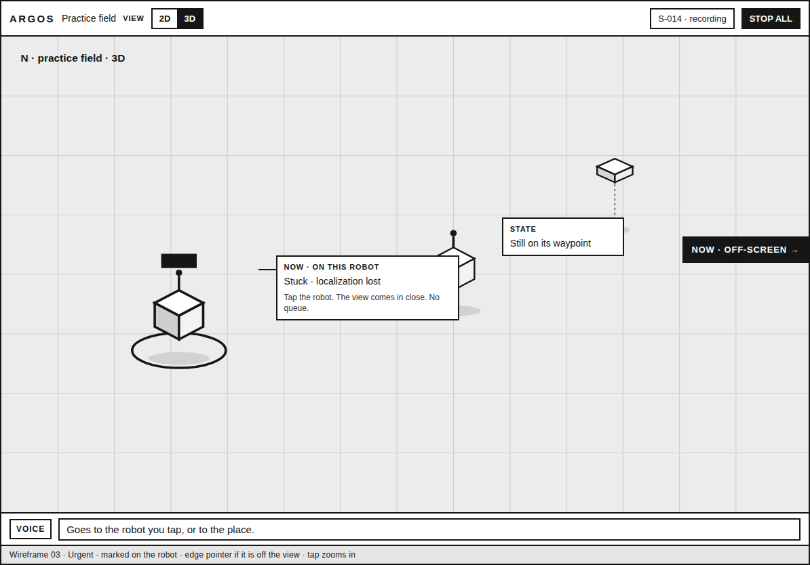
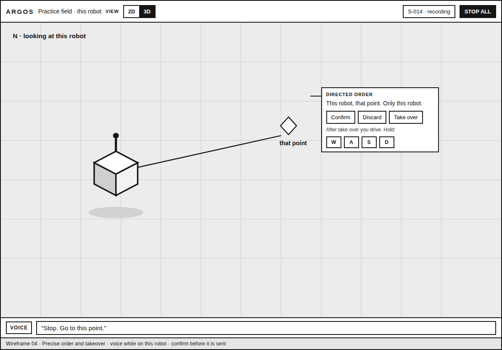
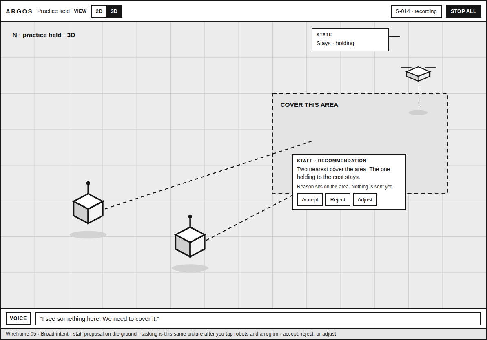
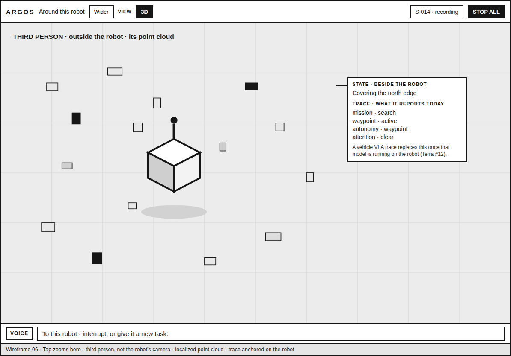

# ARGOS operator dashboard

Draft for Yojan to react to. Design only: it does not change the app. Related to [ARGOS #8](https://github.com/Super-Yojan/ARGOS/issues/8).

iPad landscape, grayscale wireframes: [`wireframes/`](wireframes/).

## Design principle

**No lists anywhere.** The screen is a place, not a menu. There is no roster of robots, no alert queue, and no tabs that switch units. Robots — and later drones and other vehicles — stand in the scene as objects. You pan, zoom, and tap the one you mean. You never switch between items in a list.

The 2D/3D control changes the camera of that same place. It is not a unit switcher. A command applies to the robot you tapped, or to the place you are looking at when no single robot is in view.

The shipping Mac and iOS app still opens on a rover list, with per-rover autonomy, takeover, stop, and session export beside it. This draft is the direction past that navigation. Explicit confirm before a motion intent is published, effective authority separate from the requested level, a latched stop with a separate reset, and an exported session log all stay.

## Command post

The operator is a general at the map. The units are already on the ground. Orders are not always “this unit, exactly that point.” They come in three grains, and the ARGOS VLA is the general’s staff.

Yojan’s picture of the console:

1. A big map, and a 3D view of that same map.
2. Robots drawn as 3D objects, not dots.
3. On an iPad, tap a robot and the view comes in close. That robot’s point cloud builds a localized **third-person** view of the robot and everything around it. It is outside the robot, not a camera from its eyes.
4. Voice interrupts whatever a robot is doing, or gives it a new task.
5. The robot’s current state, and its thinking trace, sit beside the robot in the scene.

These are high-level concepts. A trace becomes a real thinking trace when a VLA is running on the vehicle ([Terra #12](https://github.com/Super-Yojan/Terra/issues/12), on-device phone VLA). Until then, the note beside the robot shows what it reports today: mission, waypoint, autonomy level, and perception or attention reports.

Home is one place filling the screen. 2D flattens it; 3D is the sand table. Tap a robot and the camera goes to the localized third-person view. Wider, or a pinch out, returns to the place.

## Operator goals

- Read the whole field, and what each robot is trying to do, from the scene.
- Give an order at the grain you mean: an objective, a tasking, or a point.
- See the staff’s proposal on the ground, and accept, reject, or adjust it before anything is dispatched.
- Step up to a robot in third person when the field is not enough.
- Interrupt, take over, or stop from the robot you are on.
- Keep the trial recorded without putting the log on the screen.

## Information hierarchy

1. **The place**, and every robot standing in it. This is the fleet overview.
2. **Urgency**, painted on the robot that needs a person. If that robot is off the current view, a mark on the edge points toward it. Tapping the robot, or the edge mark, flies the camera to its third-person view.
3. **State and trace**, anchored to that robot.
4. **Your order and any staff recommendation**, drawn on the same ground: an area, a point, ghost paths, the bodies involved.
5. **Stop**, fixed in the corner, for the whole field, in every view.
6. **A quiet session mark.** The log stays in the export.

## What is on screen

**The place.** Fleet overview is the map. In 3D the robots are objects on it; occupancy, goals, and frontiers draw on that same ground. There is no table of vehicles beside it.

**Third person.** The localized cloud shows the robot and its surroundings from outside. State, trace, voice, and takeover belong to that robot.

**Urgency.** A ring and a NOW mark on the body. An edge pointer stands in when the body is off-screen. Going there is the acknowledgement. Nothing lines up in a column.

**Voice and the ground.** The voice bar speaks to the robot in view, or to the place on the wide map. A directed point is a tap on the ground. Both wait for a confirm on that robot before they publish. Take over requests teleop for that robot and clears held drive, as the app does now. Hold-to-drive appears on that robot once you have it.

**Staff recommendation.** An area, highlighted bodies, and dashed paths. The staff’s reason sits on the area, with Accept, Reject, and Adjust at the same visual weight, so the screen does not push one decision. Nothing is dispatched before accept.

**Safety.** STOP ALL stays in the corner, including in third person. It is immediate. Reset is a separate control on the robot you are looking at, once that robot is stopped. A safety hold is written in that robot’s callout.

**Experiment.** The corner shows the session and that recording is on. The assigned condition, intervention totals, and the event feed stay in the exported session log, so this screen does not coach the operator. The log already keeps tokens, teleop, goals, and experiment snapshots.

## Command grains

The more precise the order, the less the staff fills in. Vehicle VLAs execute locally after a directed order is confirmed, or after a recommendation is accepted.

| Grain | You say or do | What the screen does |
| --- | --- | --- |
| Broad intent | “I see something here. We need to cover it.” You can also draw the area. | The staff marks the area, the robots it would use, and ghost paths. Its reason sits on the area. Accept, reject, or adjust. |
| Tasking | Tap the robots you mean and a region, or name them by voice while they are the ones in view (“the aircraft, search that ridge”). | The same drawing. You chose the units. The staff fills routes and roles, and still asks you to accept what it added. There is no type picker and no unit list. |
| Directed order | Tap one robot and one point, or say “stop, go to this point” while you are on that robot. | One point on the ground and a confirm on that robot. The staff leaves everyone else on what they are doing. |

Take over is the finest grain: you drive the robot you are looking at.

## Two-stage VLA

A small agent runs as the ARGOS agent. VLA has two stages.

1. **ARGOS VLA, the staff.** Larger, on ARGOS, able to reason. It sees the full picture across the fleets and recommends what should and should not be done. It is the operator’s copilot.
2. **Vehicle VLA.** Smaller, on the vehicle. This is Terra #12. It handles onboard behavior.

You give a high-level command. The ARGOS VLA allocates robots and tasks and returns a recommendation. You agree, disagree, or adjust. Only then does it dispatch. The vehicle VLAs carry out the accepted work on board.

Until a vehicle VLA is running, the callout shows today’s reports. Until the ARGOS VLA is running, this same scene is where a recommendation will appear: area, ghost paths, highlighted bodies, reason beside the area, and accept / reject / adjust.

## Wireframes

Sources are the HTML files next to the PNGs. iPad landscape, grayscale, low fidelity.

### 01 · Main layout

The place fills the screen. 2D/3D is the camera. Robots are objects. State, an off-screen mark, voice, and stop are labeled. No roster.

### 02 · Normal

Three-dimensional view of the field. Each robot carries its state. A second vehicle type uses the same scene. Nothing is asking for attention.

### 03 · Urgent

NOW is on the robot. Another NOW points off the edge of the view. Tap either one to come in close.

### 04 · Directed order and takeover

Voice while on one robot: “Stop. Go to this point.” Confirm or discard. Take over is that same robot. The solid mark is the point you named.

### 05 · Broad intent

“I see something here. We need to cover it.” The staff draws the area and dashed paths, and leaves the holding vehicle out. Accept, reject, or adjust sit on that proposal. Tasking is this same picture once you have tapped the robots and the region yourself.

### 06 · Third person

Tap zooms here. The cloud is local to this robot. The camera is outside it. State and today’s trace are anchored beside it.

## Open questions

1. Should 2D and 3D ever be on screen together, or is one place plus a camera control the right iPad layout?
2. ARGOS currently discards depth pixels. What should build the localized cloud before Terra publishes one?
3. A directed order asks for one confirm. A staff allocation waits for accept / reject / adjust. Is that the split, or does every utterance go through a staff recommendation?
4. STOP ALL is immediate, with no confirm. Reset is separate, on that robot. Is that the safety rule?
5. The off-screen NOW mark is visual only here. Should it also sound, given the cognitive-load study?
6. Recording is a corner mark. Condition and intervention timing stay off this screen. Should the experimenter watch those on a second device?
7. Two bodies under one finger: the nearer one is tapped, with no chooser. Is that acceptable?
8. Voice on the wide map is staff-level intent. Voice in third person is to that robot, unless you are clearly talking about the area. Is that the rule?
