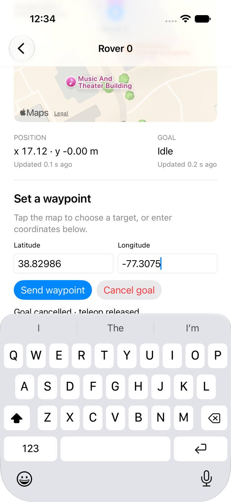

# ARGOS

!!! tip "TL;DR"
    You sit at **ARGOS**.
    **Terra** is the vehicle. **TerraPhone** is the phone on that vehicle.
    **Zorvane** is the world.
    They meet on Zenoh. The prefix is `terra/rover`.

Click a box.

<object class="system-diagram" data="assets/system.svg" type="image/svg+xml" aria-label="Clickable diagram of ARGOS, Terra, TerraPhone, and Zorvane">
  
</object>

*Operator → ARGOS → Zenoh `terra/rover` → Terra (TerraPhone on the robot) and the Zorvane simulator.*

## What you open today

<figure class="wide" markdown="1">

<figcaption>Mac app. Simulator run, 2026-10-06. Live pose, active goal.</figcaption>
</figure>

<figure class="phone" markdown="1">

<figcaption>iPhone simulator. Same prefix, after a waypoint run.</figcaption>
</figure>

The shipping screen is a rover list plus a map.

Send a waypoint. Take over. Stop.

The [scene without the list](design/operator-dashboard/README.md) is the design draft.

*Planned iPad scene. One place. Robots are objects.*

## Where to go

| Go | You will see |
| --- | --- |
| [Vision and command model](vision.md) | Intent, tasking, or a point |
| [Two-stage VLA](vla.md) | Staff model, then the vehicle model. Planned |
| [Zenoh](zenoh.md) | Keys this app actually uses |
| [Getting started](getting-started.md) | Run ARGOS against Zorvane |
| [Deployment](deployment.md) | LAN today. AWS tunnel is planned |
| [Roadmap](roadmap.md) | [Project board](https://github.com/users/Super-Yojan/projects/6) |

Source repos: [ARGOS](https://github.com/Super-Yojan/ARGOS), [Terra](https://github.com/Super-Yojan/Terra), [Zorvane](https://github.com/Super-Yojan/Zorvane).
