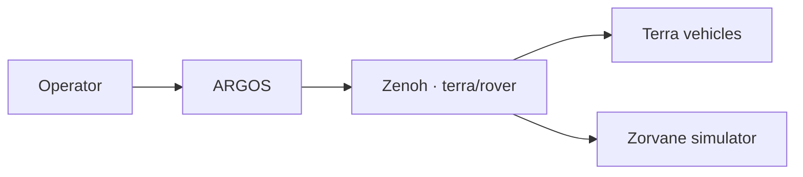

# ARGOS

ARGOS (Adaptive Robotic Group Operator System) is the operator and fleet layer. A person supervises vehicles from a native macOS and iOS app. The vehicles, and the world they drive in, live in two other repositories and meet ARGOS on a Zenoh bus whose prefix is `terra/rover`.

This site is the hub for that system.

These docs are published at [super-yojan.dev/ARGOS](https://super-yojan.dev/ARGOS/). The personal site at [super-yojan.dev](https://super-yojan.dev) links here; the nav and footer link back.

| Part | Role | Docs |
| --- | --- | --- |
| **ARGOS** (this repo) | Fleet supervision, high-level goals, takeover, and stop | You are here |
| **[Terra](https://super-yojan.dev/Terra/)** | Vehicle body, onboard autonomy, the TerraPhone iOS app, and Pi code | [TerraPhone](https://super-yojan.dev/Terra/terraphone/) |
| **[Zorvane](https://super-yojan.dev/Zorvane/)** | Platform-agnostic world simulator, extracted from Terra | [Zorvane](https://super-yojan.dev/Zorvane/) |

Source: [Super-Yojan/ARGOS](https://github.com/Super-Yojan/ARGOS), [Super-Yojan/Terra](https://github.com/Super-Yojan/Terra), [Super-Yojan/Zorvane](https://github.com/Super-Yojan/Zorvane).

## What each part owns

**ARGOS** discovers rovers, shows live pose and goal progress, and publishes latched goals, autonomy requests, supervised decisions, held teleop, and emergency stop. The Apple app is SwiftUI and MapKit. Zenoh, validation, and session logs sit in Rust and cross into Swift through UniFFI. Terra keeps sensing, onboard planning, motor selection, and watchdogs.

**Terra** is the vehicle. The body, the shared autonomy crates, TerraPhone, and the Pi motor path stay there. TerraPhone is the phone on the robot, including the onboard runtime and the Bluetooth link to the chassis. It is a different app from ARGOS.

**Zorvane** is the world: terrain, physics, cameras, and the Zenoh bridge. The Terra ground rover runs there as the `terra-ground` vehicle. ARGOS uses the same prefix and the same goal and fleet keys against Zorvane that it uses against a live rover stack. See [Getting started](getting-started.md).

## What is running today

The shipping app is a rover list with a map, four autonomy levels, supervised proposal approval, per-rover and fleet takeover, a latched emergency stop, held keyboard and touch teleop, and session-log export. Connection defaults are endpoint `tcp/127.0.0.1:7447` and prefix `terra/rover`.

The [operator dashboard design](design/operator-dashboard/README.md) is the direction past that list: one place, robots as objects, orders at three grains, and a two-stage VLA. That scene is design only. The [vision and command model](vision.md) separates the orders the app can publish now from the grains that are still planned. The [two-stage VLA](vla.md) is planned; supervised frontier approval is the gate that exists in code today.

## Read next

- [Vision and command model](vision.md)
- [Operator dashboard](design/operator-dashboard/README.md) and its [wireframes](design/operator-dashboard/wireframes/index.md)
- [Zenoh interfaces](zenoh.md)
- [Getting started](getting-started.md)
- [Deployment](deployment.md) — LAN today; AWS through a tunnel is planned
- [Roadmap](roadmap.md) — [project board](https://github.com/users/Super-Yojan/projects/6)
