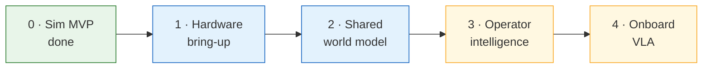

# Roadmap

!!! tip "TL;DR"
    Sim MVP is done.
    Hardware and the shared world are in progress.
    The staff model and the on-device VLA are backlog.
    The board is the source of truth.

*Live board: [ARGOS project](https://github.com/users/Super-Yojan/projects/6). Snapshot of 19 items on 2026-10-08.*

*Phase 3 draws this. The app you can run today is the list-and-map console.*

## Board

| Status | Phase | Item |
| --- | --- | --- |
| Done | 0 | [Terra #1](https://github.com/Super-Yojan/Terra/issues/1) Motor adapter |
| Done | 0 | [Terra #2](https://github.com/Super-Yojan/Terra/issues/2) iOS Zenoh `cmd_vel` |
| Done | 0 | [Terra #5](https://github.com/Super-Yojan/Terra/issues/5) ARGOS fleet MVP |
| Done | 1 | [Terra #3](https://github.com/Super-Yojan/Terra/issues/3) Phone mount checklist |
| In progress | 1 | [Terra #10](https://github.com/Super-Yojan/Terra/issues/10) TerraPhone over Bluetooth |
| Done | 1 | [Terra #17](https://github.com/Super-Yojan/Terra/issues/17) Autonomy arbiter |
| Done | 1 | [Terra #25](https://github.com/Super-Yojan/Terra/issues/25) Simulator vs device |
| Done | 1 | [ARGOS #3](https://github.com/Super-Yojan/ARGOS/issues/3) Operator dashboard MVP |
| Done | 1 | [ARGOS #4](https://github.com/Super-Yojan/ARGOS/issues/4) Autonomy switch and takeover |
| Done | 2 | [Terra #4](https://github.com/Super-Yojan/Terra/issues/4) Occupancy over Zenoh |
| Done | 2 | [Terra #9](https://github.com/Super-Yojan/Terra/issues/9) Tiles and go-to-waypoint |
| In review | 2 | [Terra #21](https://github.com/Super-Yojan/Terra/issues/21) NEXT × Zatara field |
| Backlog | 2 | [Terra #22](https://github.com/Super-Yojan/Terra/issues/22) Robot import |
| Backlog | 2 | [Terra #23](https://github.com/Super-Yojan/Terra/issues/23) Extract Zorvane |
| Backlog | 3 | [Terra #11](https://github.com/Super-Yojan/Terra/issues/11) Attention signals |
| Backlog | 3 | [ARGOS #2](https://github.com/Super-Yojan/ARGOS/issues/2) Urgency and natural language |
| Backlog | 4 | [Terra #12](https://github.com/Super-Yojan/Terra/issues/12) On-device phone VLA |
| Backlog | — | [ARGOS #8](https://github.com/Super-Yojan/ARGOS/issues/8) Dashboard design |
| Backlog | — | [Terra #27](https://github.com/Super-Yojan/Terra/issues/27) Tap-to-configure |

## Docs

[ARGOS #9](https://github.com/Super-Yojan/ARGOS/issues/9) is this documentation pass.

- [Terra](https://super-yojan.dev/Terra/)
- [TerraPhone](https://super-yojan.dev/Terra/terraphone/)
- [Zorvane](https://super-yojan.dev/Zorvane/)
- [super-yojan.dev](https://super-yojan.dev)

Shipped behavior: [commands](vision.md) and [Zenoh](zenoh.md).

Planned: the [VLA](vla.md) and [AWS tunnels](deployment.md).
