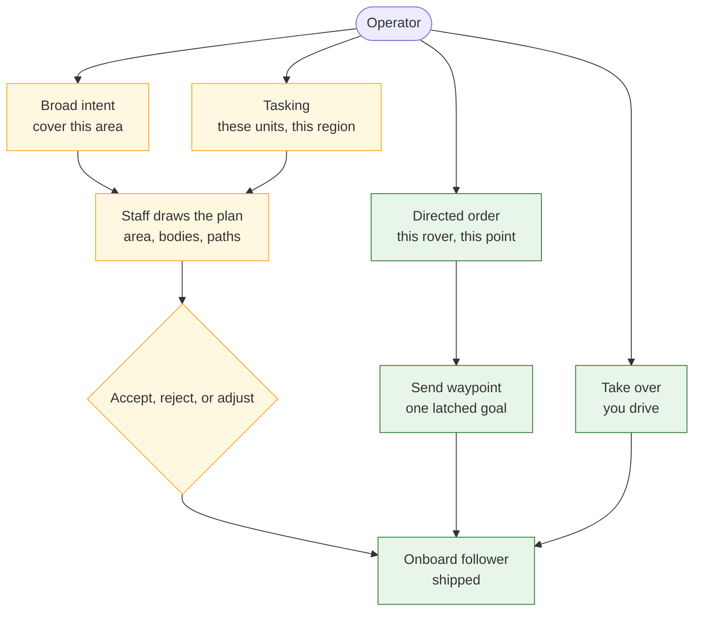
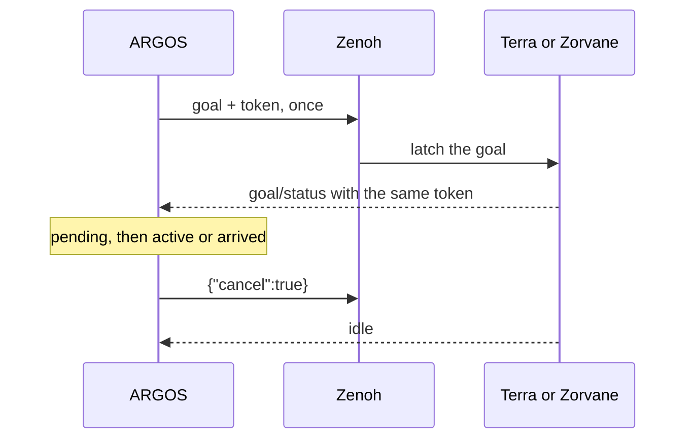

# Vision and command model

!!! tip "TL;DR"
    The operator is a general at the map.
    A coarse order asks the staff to fill in the rest.
    A point named on one rover ships today as a waypoint.
    Area intent, tasking, and voice are planned.

*Amber is planned. Green is in the app. A directed point is green. Voice on that point is still amber.*

## Three grains

*Broad intent and tasking. The staff draws the area. You accept before anything is dispatched. Planned.*

| Grain | You do | Screen | Status |
| --- | --- | --- | --- |
| Broad intent | “Cover this.” Or draw the area | Area, bodies, ghost paths, a reason | Planned |
| Tasking | Pick the units and a region | Same drawing. You chose the units | Planned |
| Directed order | One rover, one point | A point and a confirm on that rover | The point ships as a waypoint. Voice is planned |

Take over is finer still. You drive the rover you are on.

*One robot. One point. Confirm. Take over is that same robot. The point is what Send waypoint does today.*

## What Send does today

*Shipped console. A list, a map, and an explicit Send. Captured on the simulator.*

*Published is not accepted. The matching token is acceptance. Five seconds of silence is unconfirmed. ARGOS does not resend.*

- **Waypoint.** Local metres or WGS84. One publish on `<prefix>/<id>/goal`.
- **Cancel.** Exactly `{"cancel":true}`. Idle releases the latch. Closing the app leaves the goal in place.
- **Autonomy.** `teleop`, `assisted_teleop`, `waypoint`, or `supervised`. Requested level and effective level stay separate.
- **Supervised.** A `goal/proposal` does not move the robot. Approve or reject sends `goal/decision` with the proposal id and the run id.
- **Stop.** `safety` `stop` latches at Terra. `reset` is a second action.
- **Teleop.** W/S and A/D, about every 50 ms, on `<prefix>/<id>/teleop`. Values are −1, 0, or 1. Release sends zero.

Full key list: [Zenoh interfaces](zenoh.md). The scene these grains belong to: [dashboard design](design/operator-dashboard/README.md). The staff that would draw the amber boxes: [two-stage VLA](vla.md).

## Rules that stay

- Pose, goal, and membership each go stale at 2.5 seconds.
- A rover that has left the fleet cannot take a new goal.
- Local axes stay within ±20 km. Latitude [−85, 85]. Longitude [−180, 180]. Yaw within ±2π.
- Goal-status `x` and `y` are the target. The rover’s position comes from pose.
- +x is north. +y is west of the anchor you typed. The bus does not advertise that anchor.
- One operator. Cancel has no token.
- The waypoint follower does not plan around obstacles.

Issues: [#2](https://github.com/Super-Yojan/ARGOS/issues/2) natural language and urgency. [#8](https://github.com/Super-Yojan/ARGOS/issues/8) the dashboard design.
