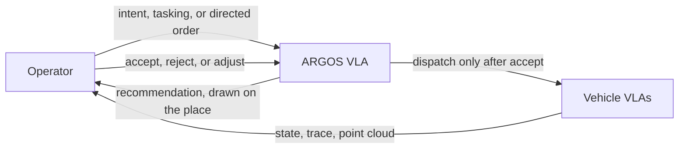

# Two-stage VLA

Vision-language-action in this system is two models with a person between them. The split is the one drawn in the [operator dashboard design](design/operator-dashboard/README.md). Neither stage is implemented in this repository.

!!! warning "Planned"
    There is no VLA crate, no model weight, no prompt, and no recommendation topic in ARGOS. The diagram is the target architecture. Supervised frontier approval, below, is the human gate that exists in code today.

## ARGOS VLA, the staff

The larger model runs with the operator. It sees the fleet, not one camera. A high-level command comes in as a broad intent, a tasking, or a directed order. The staff allocates vehicles and tasks and draws the recommendation on the same ground: an area, highlighted bodies, dashed paths, and a reason. Accept, reject, and adjust have the same visual weight. Dispatch happens after accept.

That agent is the operator-intelligence work in [ARGOS #2](https://github.com/Super-Yojan/ARGOS/issues/2): perception and attention reports in, an urgency ranking of who needs a person, and a natural-language path that becomes a validated high-level command. The issue also asks for a fail-closed VLA sketch and a person in the loop for high-risk actions. Those items are open.

Until that model is running, the dashboard design says the same scene is where a recommendation will appear. The shipping app has nowhere to draw an area or a ghost path.

## Vehicle VLA

The smaller model runs on the vehicle. It is [Terra #12](https://github.com/Super-Yojan/Terra/issues/12), an on-device phone VLA on TerraPhone (a Gemma-class model in that issue’s current wording). Onboard behavior, a thinking trace, and a localized cloud belong there. ARGOS would show the trace beside the robot. Until a vehicle VLA is running, the callout shows what Terra already reports: mission, waypoint, autonomy level, and whatever perception or attention text the vehicle publishes.

Terra #12 is backlog on the [project board](roadmap.md). The phone app and its build notes live on the [TerraPhone](https://super-yojan.dev/Terra/terraphone/) section of the Terra site.

## What stands in for the gate today

Terra’s onboard autonomy can propose a search frontier. ARGOS subscribes to `<prefix>/<id>/goal/proposal` and publishes `<prefix>/<id>/goal/decision`.

A proposal carries `proposal_id`, `run_id`, a local `x` and `y`, and `expires_at`. Approve and reject require the proposal id and the run id. A proposal from another run is ignored. The buttons disable when autonomy status is stale or the proposal’s remaining time is spent. Resume is a decision without a proposal id, still bound to the run id.

That is a person accepting a frontier the vehicle already proposed. The accept-before-dispatch shape is the same one the staff recommendation will use. Fleet-wide allocation, natural language, adjust-in-place, and a trace from a vehicle model remain the planned ARGOS VLA and vehicle VLA above.

Directed waypoints skip the staff on purpose. The operator names one rover and one point, confirms by sending, and ARGOS publishes one goal. See [Vision and command model](vision.md) and the wire formats in [Zenoh interfaces](zenoh.md).
