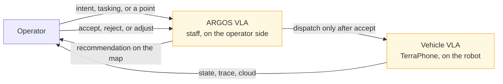
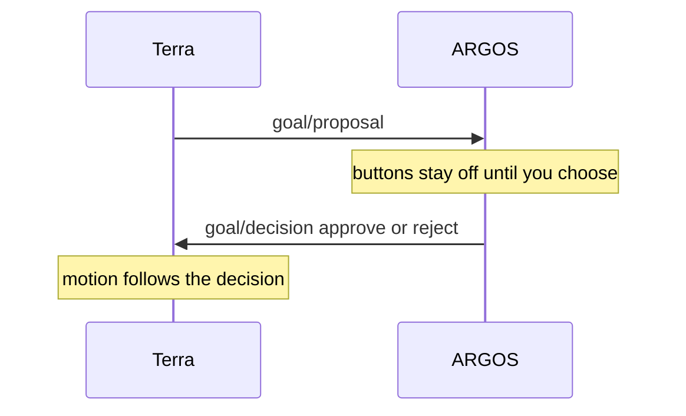

# Two-stage VLA

!!! warning "TL;DR · planned"
    Two models. A person stands between them.
    **ARGOS VLA** sees the whole fleet and recommends.
    **Vehicle VLA** runs on TerraPhone and drives the local behavior.
    Neither model is in this repo.

*Both boxes are planned. Dispatch waits for accept.*

## The staff, on ARGOS

*Where the staff recommendation will sit. Same visual weight for accept, reject, and adjust.*

The larger model sits with the operator.

It sees every vehicle.

A high-level order comes in. The staff allocates robots and draws the plan: an area, highlighted bodies, dashed paths, a reason.

You agree, disagree, or adjust. Then it dispatches.

That work is [ARGOS #2](https://github.com/Super-Yojan/ARGOS/issues/2). Attention reports, an urgency ranking, and natural language that becomes a validated command. Open.

## The vehicle model, on TerraPhone

*The callout beside the robot. A real thinking trace arrives with the vehicle VLA. Until then it shows mission, waypoint, and autonomy.*

The smaller model runs on the phone on the robot.

[Terra #12](https://github.com/Super-Yojan/Terra/issues/12). On-device. Backlog on the [roadmap](roadmap.md).

Build notes for that phone: [TerraPhone](https://super-yojan.dev/Terra/terraphone/).

## The gate that exists today

Terra can propose a search frontier.

ARGOS shows it. Approve and reject publish `goal/decision`.

The proposal carries `proposal_id`, `run_id`, `x`, `y`, and `expires_at`.

A proposal from another run is ignored. Stale status disables the buttons.

*A person accepts a frontier the vehicle already proposed. Fleet-wide allocation and a model trace are the planned stages above.*

A directed waypoint skips the staff. You name one rover and one point. ARGOS publishes one goal. See [command grains](vision.md).
