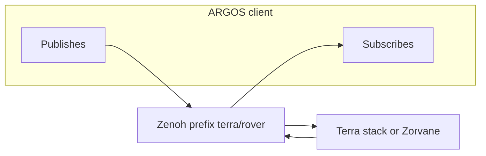

# Zenoh interfaces

ARGOS is a Zenoh client. The session is opened in `crates/argos-zenoh` and the key shapes are built in `crates/argos-core` (`Topics`). The default prefix is `terra/rover`, overridable in Connection so it matches `TERRA_ZENOH_PREFIX` on Terra or Zorvane.

The client forces Zenoh mode `client`, sets `connect/endpoints` to the single configured endpoint, disables multicast scouting, and uses a 3000 ms connect timeout. The endpoint must start with `tcp/`, parse as a Zenoh endpoint, and be at most 512 characters. The prefix is a concrete key: no empty segments, no whitespace, no `* ? # $`, at most 256 characters.

## Subscriptions

| Key | Decoder | What ARGOS keeps |
| --- | --- | --- |
| `<prefix>/fleet/state` | `decode_fleet` | `count`, `max_count`, `ids`. Duplicate ids are rejected. `count` differing from `ids.len()` becomes a notice |
| `<prefix>/*/goal/status` | `decode_status` | `idle` / `active` / `arrived`, `goal_id`, remaining `distance`, target `x`/`y`, optional token, yaw, latitude, longitude |
| `<prefix>/*/camera/depth` | `decode_pose` | Exposure-aligned `body` pose (`x`, `y`, `yaw`) from a version-1 `32FC1_LE` header. Pixel bytes are discarded |
| `<prefix>/*/pose` | `decode_body_pose` | JSON body pose (`rover_id`, `sequence`, `x`, `y`, `yaw`) when a phone-owned runtime publishes pose directly |
| `<prefix>/*/map/occupancy` | `decode_occupancy` | Schema version 1 grid: run id, sequence, width, height, resolution, origin, cells in −1…100. At most 250000 cells and 2000000 bytes. A grid whose `rover_id` disagrees with the key is dropped. An older sequence for the same run is dropped |
| `<prefix>/*/**` | `OperatorCache::apply` | Only keys ending in `autonomy/status`, `goal/proposal`, `mission/status`, or `experiment/status`. Other samples on this wildcard are ignored. Absent members are ignored |

Pose, goal status, and fleet membership age on their own clocks. `STALE_SECONDS` is 2.5. A failed decode keeps the last good value and does not refresh its age. Occupancy from a different `run_id` replaces the stored grid; the map UI hides a grid whose run does not match current telemetry.

`goal/status` `x` and `y` are the goal after projection. Rover position comes from `body` in the depth header or from `<prefix>/<id>/pose`.

## Publications

| Key | When | Body |
| --- | --- | --- |
| `<prefix>/<id>/goal` | Send waypoint, once | `{"frame":"local","x","y","token"}` or `{"frame":"wgs84","latitude","longitude","token"}`, optional `yaw`. At most 2048 bytes |
| `<prefix>/<id>/goal` | Cancel, once | `{"cancel":true}` |
| `<prefix>/<id>/autonomy` | Level change, takeover | `{"level":"teleop"\|"assisted_teleop"\|"waypoint"\|"supervised","token"}` |
| `<prefix>/<id>/safety` | Stop or reset | `{"action":"stop"\|"reset","token"}` |
| `<prefix>/<id>/goal/decision` | Approve, reject, or resume | `{"decision":"approve"\|"reject"\|"resume","proposal_id","run_id","token"}`. Resume omits `proposal_id` |
| `<prefix>/<id>/mission/report` | Confirmed survivor | `{"survivor_id","token"}` |
| `<prefix>/<id>/teleop` | Held drive, about every 50 ms, and a zero on release | `{"linear","angular","operator_session_id","sequence","run_id","authority_revision"}` with linear and angular in {−1, 0, 1} |

Tokens are UUIDs. A goal token must come back on `goal/status` before the command leaves `pending`. Autonomy, safety, and decision tokens are matched against `autonomy/status.token` and `result`. Unmatched goal and cancel commands become `unconfirmed` after five seconds. Other operator actions become `unconfirmed` after two seconds. ARGOS does not retry a goal and does not replay a command after reconnect.

Fleet takeover and fleet stop call the same per-rover publisher once per id in the current snapshot, under one parent id in the session log. Each rover keeps its own token.

Teleop is published only while `can_drive` is true: status newer than 2.5 seconds, `safety == "clear"`, and `effective_level` of `teleop` or `assisted_teleop`, with any pending action already accepted or rejected. The published key is `teleop`. Zorvane’s Python debug client still drives `<prefix>/<id>/cmd_vel`. ARGOS does not publish `cmd_vel`. A latched goal ignores twists until cancel, on the vehicle side.

Disconnect clears held input, publishes a zero twist when a rover was held, drops subscriptions, and marks the link disconnected. It does not publish cancel.

## Keys ARGOS does not use

These exist on the Terra/Zorvane bus and are documented in Zorvane’s `simulator/ZENOH.md`. This client does not subscribe or publish them:

- `<prefix>/<id>/cmd_vel` — debug twist used by the Python client and by TerraPhone’s direct drive path
- `<prefix>/<id>/camera/rgb` — RGB frames. ARGOS never decodes them
- `<prefix>/fleet/size` — live fleet resize. ARGOS reads `fleet/state` and does not request a new count

Depth packets still arrive in full, so depth bandwidth is on the link even though the pixels are dropped. Building a third-person cloud from those pixels is an open question in the dashboard design, because the client discards them.

## Session log

On connect, the client writes `argos-session-<uuid>.jsonl` under the temp directory. Records include `goal_sent`, `goal_cancel_sent`, `action_sent`, `fleet_action`, `teleop_sent`, and `state_observed`, with session-relative monotonic time and UTC. Export copies that log to the path the operator picks. The manifest’s `platform` is `argos` and `clock` is `session_relative_monotonic`.
