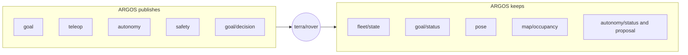
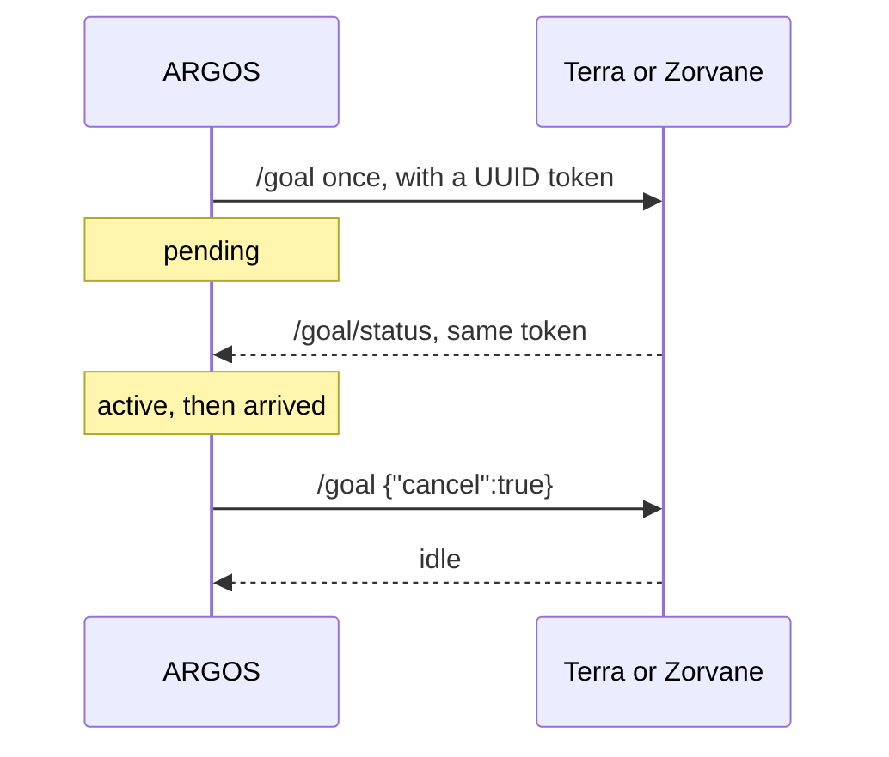

# Zenoh interfaces

!!! tip "TL;DR"
    ARGOS is a TCP client. Multicast is off.
    Default prefix: `terra/rover`. Default endpoint: `tcp/127.0.0.1:7447`.
    Goals go out once. Status with the same token means accepted.
    Teleop is `<id>/teleop`. ARGOS does not publish `cmd_vel`.

*One session. Mode `client`. Connect timeout 3 seconds. Endpoint must be `tcp/…`.*

## Round trip for a waypoint

*Five seconds with no token: unconfirmed. ARGOS does not retry. Disconnect does not cancel.*

## Subscriptions

| Key | What ARGOS keeps |
| --- | --- |
| `<prefix>/fleet/state` | `count`, `max_count`, `ids` |
| `<prefix>/*/goal/status` | `idle` / `active` / `arrived`, distance, target `x`/`y`, token |
| `<prefix>/*/camera/depth` | `body` pose from the header. Pixels are dropped |
| `<prefix>/*/pose` | JSON pose when the phone runtime publishes it |
| `<prefix>/*/map/occupancy` | Grid, schema 1, cells −1…100 |
| `<prefix>/*/**` | Only `autonomy/status`, `goal/proposal`, `mission/status`, `experiment/status` |

Pose, goal, and membership each go stale at 2.5 seconds.

`goal/status` `x` and `y` are the target. Position comes from pose.

## Publications

| Key | Body |
| --- | --- |
| `<prefix>/<id>/goal` | One local or WGS84 goal, plus `token`. Or `{"cancel":true}` |
| `<prefix>/<id>/autonomy` | `level` + `token`. Four levels |
| `<prefix>/<id>/safety` | `stop` or `reset`, plus `token` |
| `<prefix>/<id>/goal/decision` | `approve`, `reject`, or `resume` |
| `<prefix>/<id>/mission/report` | `survivor_id` + `token` |
| `<prefix>/<id>/teleop` | `linear` and `angular` in {−1, 0, 1}, about every 50 ms |

Fleet stop and fleet takeover send one message per rover. Each rover keeps its own token.

## Other keys on the same bus

Zorvane still has these. This client leaves them alone.

| Key | Who uses it |
| --- | --- |
| `<prefix>/<id>/cmd_vel` | Zorvane’s Python client, and TerraPhone’s direct drive |
| `<prefix>/<id>/camera/rgb` | Frame viewers. ARGOS never decodes RGB |
| `<prefix>/fleet/size` | Live resize. ARGOS only reads `fleet/state` |

Depth frames still arrive whole, so the bandwidth is on the link. The third-person cloud in the [dashboard design](design/operator-dashboard/README.md) needs a cloud from Terra. This client discards the pixels.

## Session log

On connect, ARGOS writes `argos-session-<uuid>.jsonl` in the temp directory.

Goals, cancels, actions, teleop packets, and observed state each get a line.

Export copies that file. A failed recorder stays visible. Stop still works.
